FLP
================

``` r
library(tidyverse) 
```

    ## ── Attaching packages ─────────────────────────────────────── tidyverse 1.3.1 ──

    ## ✔ ggplot2 3.3.6     ✔ purrr   0.3.4
    ## ✔ tibble  3.1.7     ✔ dplyr   1.0.9
    ## ✔ tidyr   1.2.0     ✔ stringr 1.4.0
    ## ✔ readr   2.1.2     ✔ forcats 0.5.1

    ## ── Conflicts ────────────────────────────────────────── tidyverse_conflicts() ──
    ## ✖ dplyr::filter() masks stats::filter()
    ## ✖ dplyr::lag()    masks stats::lag()

``` r
library(reshape2)
```

    ## Warning: package 'reshape2' was built under R version 4.2.2

    ## 
    ## Attaching package: 'reshape2'

    ## The following object is masked from 'package:tidyr':
    ## 
    ##     smiths

``` r
library(scales)
```

    ## 
    ## Attaching package: 'scales'

    ## The following object is masked from 'package:purrr':
    ## 
    ##     discard

    ## The following object is masked from 'package:readr':
    ## 
    ##     col_factor

``` r
library(STAT)
```

    ## Warning: package 'STAT' was built under R version 4.2.2

``` r
Clean_Dataset <- read_csv("C:/Users/ahmed/Desktop/Clean_Dataset.csv")
```

    ## New names:
    ## Rows: 300153 Columns: 12
    ## ── Column specification
    ## ──────────────────────────────────────────────────────── Delimiter: "," chr
    ## (8): airline, flight, source_city, departure_time, stops, arrival_time, ... dbl
    ## (4): ...1, duration, days_left, price
    ## ℹ Use `spec()` to retrieve the full column specification for this data. ℹ
    ## Specify the column types or set `show_col_types = FALSE` to quiet this message.
    ## • `` -> `...1`

general look on the data

``` r
summary(Clean_Dataset)
```

    ##       ...1          airline             flight          source_city       
    ##  Min.   :     0   Length:300153      Length:300153      Length:300153     
    ##  1st Qu.: 75038   Class :character   Class :character   Class :character  
    ##  Median :150076   Mode  :character   Mode  :character   Mode  :character  
    ##  Mean   :150076                                                           
    ##  3rd Qu.:225114                                                           
    ##  Max.   :300152                                                           
    ##  departure_time        stops           arrival_time       destination_city  
    ##  Length:300153      Length:300153      Length:300153      Length:300153     
    ##  Class :character   Class :character   Class :character   Class :character  
    ##  Mode  :character   Mode  :character   Mode  :character   Mode  :character  
    ##                                                                             
    ##                                                                             
    ##                                                                             
    ##     class              duration       days_left      price       
    ##  Length:300153      Min.   : 0.83   Min.   : 1   Min.   :  1105  
    ##  Class :character   1st Qu.: 6.83   1st Qu.:15   1st Qu.:  4783  
    ##  Mode  :character   Median :11.25   Median :26   Median :  7425  
    ##                     Mean   :12.22   Mean   :26   Mean   : 20890  
    ##                     3rd Qu.:16.17   3rd Qu.:38   3rd Qu.: 42521  
    ##                     Max.   :49.83   Max.   :49   Max.   :123071

``` r
boxplot(Clean_Dataset$price)
```

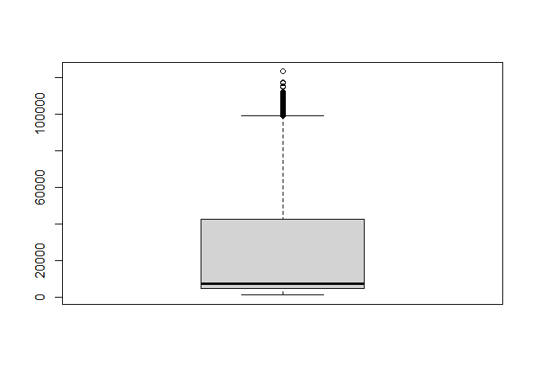<!-- --> data is clean
but contains outliers

maximum row

``` r
Clean_Dataset[which.max(Clean_Dataset$price),]
```

    ## # A tibble: 1 × 12
    ##     ...1 airline flight source_city departure_time stops arrival_time
    ##    <dbl> <chr>   <chr>  <chr>       <chr>          <chr> <chr>       
    ## 1 261377 Vistara UK-772 Kolkata     Morning        one   Night       
    ## # … with 5 more variables: destination_city <chr>, class <chr>, duration <dbl>,
    ## #   days_left <dbl>, price <dbl>

``` r
df<-sample_n(Clean_Dataset,5000)
```

taking a sample for statstical tests

``` r
df<-sample_n(Clean_Dataset,5000)
```

some statstical tests

``` r
cor(df$price , df$days_left,method = 'spearman')
```

    ## [1] -0.2691977

``` r
kruskal.test(df$airline,df$price)
```

    ## 
    ##  Kruskal-Wallis rank sum test
    ## 
    ## data:  df$airline and df$price
    ## Kruskal-Wallis chi-squared = 4254.8, df = 1977, p-value < 2.2e-16

``` r
kruskal.test(df$departure_time,df$price)
```

    ## 
    ##  Kruskal-Wallis rank sum test
    ## 
    ## data:  df$departure_time and df$price
    ## Kruskal-Wallis chi-squared = 2332.7, df = 1977, p-value = 4.161e-08

``` r
kruskal.test(df$arrival_time,df$price)
```

    ## 
    ##  Kruskal-Wallis rank sum test
    ## 
    ## data:  df$arrival_time and df$price
    ## Kruskal-Wallis chi-squared = 2433, df = 1977, p-value = 6.473e-12

``` r
kruskal.test(df$destination_city,df$price)
```

    ## 
    ##  Kruskal-Wallis rank sum test
    ## 
    ## data:  df$destination_city and df$price
    ## Kruskal-Wallis chi-squared = 4625.7, df = 1977, p-value < 2.2e-16

``` r
shapiro.test(df$price)
```

    ## 
    ##  Shapiro-Wilk normality test
    ## 
    ## data:  df$price
    ## W = 0.75835, p-value < 2.2e-16

``` r
kruskal.test(df$days_left,df$price)
```

    ## 
    ##  Kruskal-Wallis rank sum test
    ## 
    ## data:  df$days_left and df$price
    ## Kruskal-Wallis chi-squared = 3203.9, df = 1977, p-value < 2.2e-16

answer to first question(yes price does vary between airlines

``` r
ggplot(Clean_Dataset,aes(x=class,y=price,fill = stops))+
         geom_bar(stat = 'identity')+
         facet_wrap(~ Clean_Dataset$airline)
```

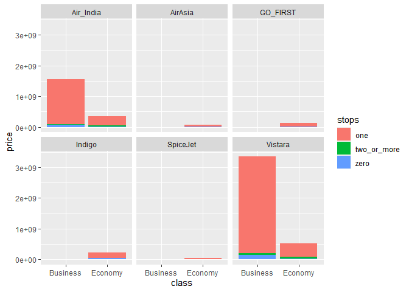<!-- -->

``` r
df3<-Clean_Dataset%>%
  mutate(dl = case_when(
    days_left <= 10 ~ "late",
    days_left > 10 ~ "early"
  ))
```

air india is the most expensive in both clases followed by airasia in
economy and vistara in business

``` r
ggplot(df3,aes(x=dl,y=price,fill = airline))+
  geom_bar(stat = 'identity',position = "fill")+
  facet_wrap(~ class)
```

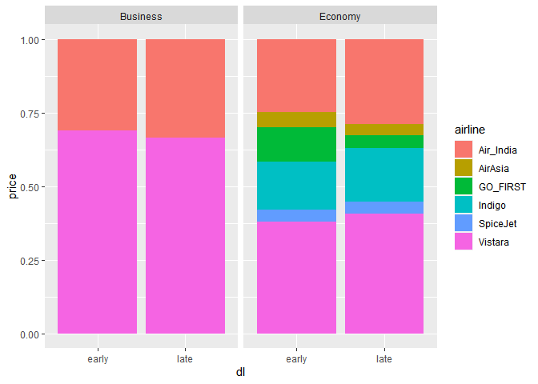<!-- -->

late tickets are cheaper

``` r
ggplot(df3,aes(x=dl,y=median(price)))+
  geom_bar(stat = 'identity')+
  facet_wrap(~ class)
```

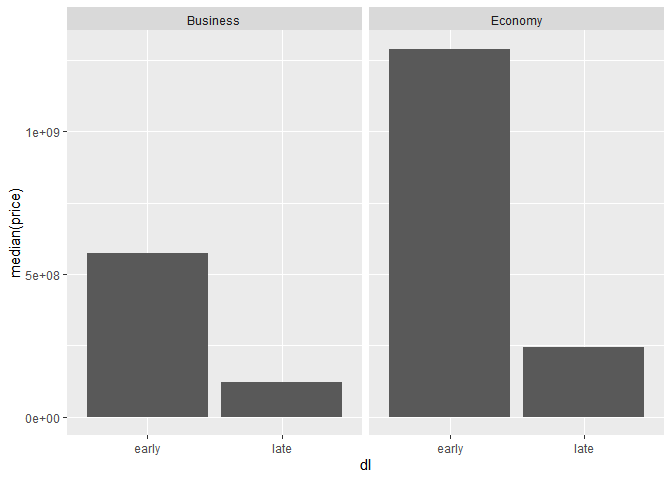<!-- -->

business is much more expensive than economy

``` r
ggplot(df3,aes(x=dl,y=price,fill = airline))+
  geom_bar(stat = 'identity')+
  facet_wrap(~ class)
```

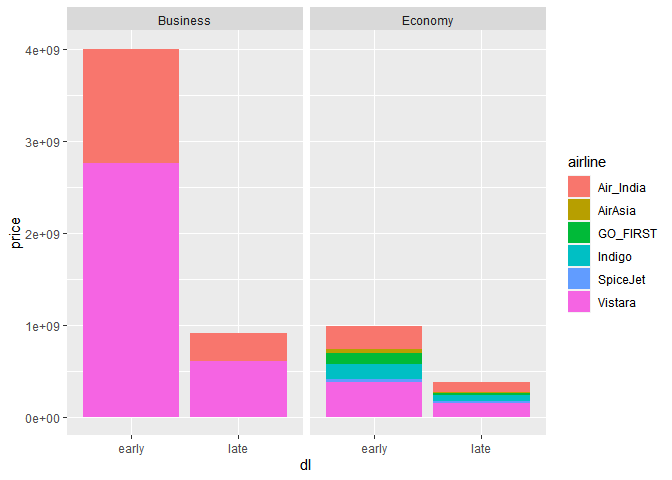<!-- -->

stops does affect the price

``` r
df4<-Clean_Dataset%>%
  group_by(stops)%>%
  summarise(total=n(),mp = median(price))
  
  
  ggplot(df4,aes(x=stops,y=mp,fill=total))+
    geom_bar(stat='identity')
```

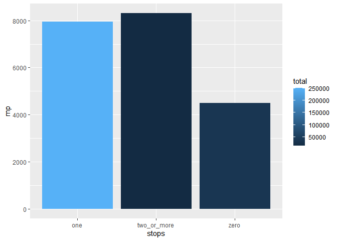<!-- --> there is a
slight effct on price depending on departure time

``` r
df5<-Clean_Dataset%>%
  group_by(departure_time)%>%
    summarise(total=n(),mp = median(price))

  
  ggplot(df5,aes(x=departure_time,y=mp,fill=total))+
    geom_bar(stat='identity')
```

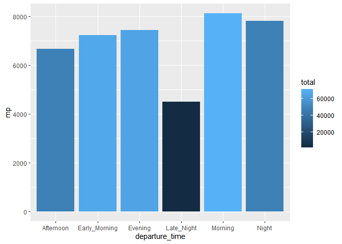<!-- --> theres a slight
effct on pricee depending on arrival time

``` r
  df6<-Clean_Dataset%>%
    group_by(arrival_time)%>%
    summarise(total=n(),mp = median(price))
  
  ggplot(df6,aes(x=arrival_time,y=mp,fill=total))+
    geom_bar(stat='identity')
```

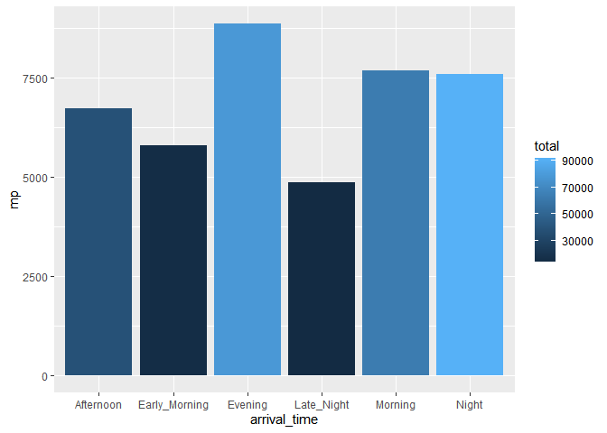<!-- -->

``` r
df7<-Clean_Dataset%>%
    group_by(destination_city)%>%
    summarise(total=n(),mp = median(price))

  ggplot(df7,aes(x=destination_city,y=mp,fill=total))+
    geom_bar(stat='identity')
```

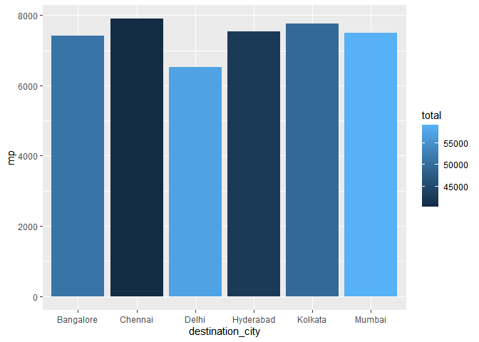<!-- -->

``` r
  df8<-Clean_Dataset%>%
    group_by(source_city)%>%
    summarise(total=n(),mp = median(price))

  
  ggplot(df8,aes(x=source_city,y=mp,fill=total))+
    geom_bar(stat='identity')
```

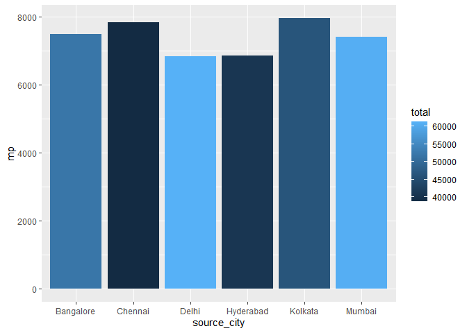<!-- --> Trip duration
affect the price

``` r
df9<-Clean_Dataset%>%
    mutate(du = case_when(
      duration <= 3 ~ "short", duration > 3 & duration <=7 ~ "normal", duration > 7 ~ "long"))
  
  df9<-df9%>%
    group_by(du)%>%
    summarise(total=n(),mp=median(price))
  
ggplot(df9,aes(x=du,y=mp,fill = total))+
geom_bar(stat = 'identity')
```

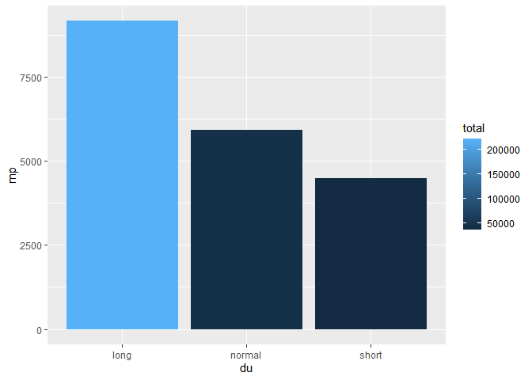<!-- -->
